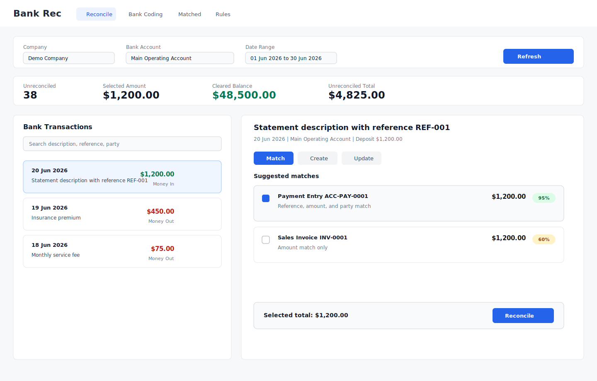
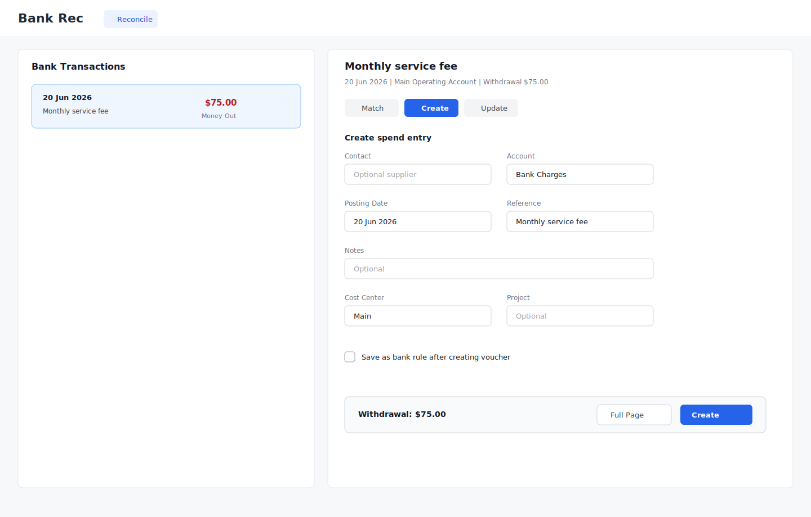
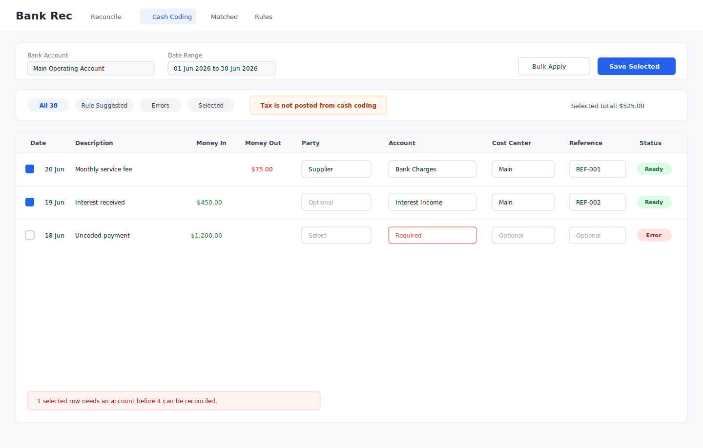

# Bank Rec Modern UI Design

## Purpose

Build a new Xero-inspired, NexWave-native bank reconciliation experience for the `advanced_bank_reconciliation` app without changing the existing `Advance Bank Reconciliation Tool`.

The current tool must remain available and working as-is. The new experience will be a separate full-screen route app, built with Vue 3, Vite, and Frappe UI, similar to the architecture used by Frappe Helpdesk.

## Product Positioning

This is not a 100% Xero parity project. The UI should borrow the parts of Xero that make daily work faster, especially the split-screen transaction flow and the cash-coding grid, but the accounting model must remain NexWave-native.

Key model difference:

- NexWave reconciliation is clearance-date based. A transaction is reconciled when the selected voucher, Payment Entry, Journal Entry, or invoice payment row is linked and its `clearance_date` is set or cleared by the existing ABR engine.
- Xero appears to behave more like a dated reconciliation session, where a reconciliation run can commit the state as of a specific date.
- Do not introduce a new reconciliation-session DocType or a dated close workflow in MVP.
- Date range filters in `/bank-rec` are work filters. They are not a reconciliation session boundary.

MVP positioning:

- Strong fit: matching imported bank transactions to existing documents, creating simple vouchers from bank transactions, and bulk coding rows where tax treatment is not required.
- Not positioned as a Xero replacement for GST/BAS-style daily tax coding until the later tax phase is designed and built.

## Recommendation

Use `/bank-rec` as the primary route.

Rationale:

- It is short enough to type and remember.
- It reads like a product/workspace name, not a developer utility.
- "Tool" is redundant in user navigation. The UI itself is the tool.
- It leaves room for subroutes such as `/bank-rec/reconcile`, `/bank-rec/cash-coding`, `/bank-rec/matched`, and `/bank-rec/rules`.

No compatibility route:

- Do not add `/bank-rec-tool`.
- Keep one canonical route so bookmarks, app search, docs, and support instructions all point to `/bank-rec`.

## Explicit Non-Goals

- Do not modify the existing Single DocType form at `/app/advance-bank-reconciliation-tool`.
- Do not reuse the current modal-first UI as the primary interaction model.
- Do not replace the proven reconciliation backend in the first version.
- Do not implement transfers between bank accounts in MVP.
- Do not implement split cash coding in MVP.
- Do not implement tax-rate behavior for cash coding in MVP.
- Do not introduce a Xero-style reconciliation-session model in MVP.
- Do not expose customer-specific examples, names, URLs, or data in docs, tests, commits, or PR text.

## Product Shape

The new UI has three primary surfaces:

1. Reconcile
2. Cash Coding
3. Review Matched

Bank rules remain accessible through a minimal MVP list, with edit and delete handled by links to the existing Desk form. Settings are loaded behind the scenes and should not appear as an MVP navigation item until a user-facing settings workflow is designed.

## Confirmed Scope Decisions

- Primary route: `/bank-rec`.
- App screen label: `Bank Rec`.
- Do not add `/bank-rec-tool` as a route or redirect.
- Transfers are a later iteration, not MVP.
- Cash coding splits are a later iteration, not MVP.
- Tax coding is a later iteration after the accounting treatment is specified.
- Reconciliation remains clearance-date based. No reconciliation-session model is planned for MVP.
- The Update tab is included in MVP for bank-transaction metadata edits.
- Rules are included in MVP as a minimal list with Desk links, not a full rule-management surface.
- Settings are hidden in MVP navigation.

## Route And App Shell

Canonical route:

```text
/bank-rec
```

Suggested subroutes:

```text
/bank-rec/reconcile
/bank-rec/cash-coding
/bank-rec/matched
/bank-rec/rules
```

Frappe route wiring:

```python
add_to_apps_screen = [
    {
        "name": "bank_rec",
        "title": "Bank Rec",
        "route": "/bank-rec",
        "has_permission": "advanced_bank_reconciliation.api.permission.has_bank_rec_permission",
    }
]

website_route_rules = [
    {"from_route": "/bank-rec", "to_route": "bank_rec"},
    {"from_route": "/bank-rec/<path:app_path>", "to_route": "bank_rec"},
]
```

Template location:

```text
advanced_bank_reconciliation/www/bank_rec/index.html
advanced_bank_reconciliation/www/bank_rec/index.py
```

The `bank_rec` Python page serves the Vue app shell. The browser-visible URL remains `/bank-rec`.

Route state:

- Persist `bank_account`, `from_date`, `to_date`, and the selected `bank_transaction` in the URL query where the current page uses them.
- Restore those query values on hard refresh and direct subroute visits such as `/bank-rec/cash-coding`.
- If a restored bank account or transaction is no longer permitted or no longer exists in the filtered result, show the normal empty or permission state and fall back to the first valid row only when that is safe.
- Use route replace for frequent selection changes so browser Back remains useful.

## Frontend Architecture

Use a Helpdesk-style frontend inside the ABR app:

```text
apps/advanced_bank_reconciliation/
  bank_rec/
    package.json
    vite.config.js
    tailwind.config.js
    src/
      main.ts
      App.vue
      router/index.ts
      pages/
        ReconcilePage.vue
        CashCodingPage.vue
        MatchedPage.vue
        RulesPage.vue
      components/
        AppShell.vue
        BankAccountSwitcher.vue
        StatementSummary.vue
        TransactionList.vue
        TransactionDetailPanel.vue
        MatchPanel.vue
        CreateVoucherPanel.vue
        UpdateTransactionPanel.vue
        CashCodingGrid.vue
        ReconcileProgressDialog.vue
      stores/
        bankAccounts.ts
        transactions.ts
        matching.ts
        cashCoding.ts
        settings.ts
      services/
        api.ts
        formatting.ts
        validation.ts
```

Build output:

```text
advanced_bank_reconciliation/public/bank_rec/
```

Why not use the existing `frontend/` or `dashboard/` folders:

- They currently contain only `node_modules` and no app source.
- Reusing those names would be ambiguous.
- A `bank_rec/` folder makes ownership and build output clear.

## Technology Choice

Use:

- Vue 3
- TypeScript
- Vite
- Frappe UI
- Pinia
- Vue Router
- Tailwind with the Frappe UI preset

Why Vue instead of React:

- Frappe UI is Vue-first.
- Helpdesk already demonstrates the pattern in this bench.
- `createResource`, dialogs, toasts, form controls, list components, and theme handling fit the proposed UI.
- The app needs a dense operational interface, not a marketing-style frontend.

## Frappe UI Dependency Strategy

Do not add `frappe-ui` as a Git submodule for the first ABR implementation.

Use `frappe-ui` as a pinned package dependency in the new frontend `package.json`, with the lockfile committed. This keeps installation, CI, and dependency updates straightforward.

Why Helpdesk has a `frappe-ui` submodule:

- Helpdesk is a Frappe-maintained Vue app, so the team often needs to develop the app and the shared component library together.
- The submodule lets developers test unreleased `frappe-ui` changes before an npm release exists.
- Their Vite config can alias `frappe-ui` to the local checkout in development, then fall back to the npm package.
- It can pin a specific source commit when the app depends on behavior not yet published.

Why ABR should start without the submodule:

- We are consuming Frappe UI, not actively developing Frappe UI.
- A submodule adds onboarding steps, CI checkout complexity, and another source of version drift.
- The ABR route app should be stable and easy to install in existing benches.
- Most UI needs should be satisfied by a pinned npm release.

Recommended compromise:

- Keep `frappe-ui` as a normal npm dependency.
- Add an optional local-development alias in Vite, similar to Helpdesk, only if `../frappe-ui` exists and has dependencies installed.
- Do not commit `frappe-ui` as a submodule unless ABR later needs unreleased Frappe UI fixes or we decide to contribute changes upstream.

## Backend Architecture

Keep existing reconciliation functions where they are stable. Add a new API facade for the new UI.

Suggested modules:

```text
advanced_bank_reconciliation/api/
  __init__.py
  permission.py
  bank_rec.py
  matching.py
  cash_coding.py
```

The new API facade should call existing reconciliation functions rather than duplicating logic.

Primary API methods:

```python
get_boot()
get_bank_accounts(company=None)
get_bank_rules(bank_account=None)
get_statement_summary(bank_account, from_date, to_date)
get_transactions(bank_account, from_date, to_date, status="unreconciled")
get_transaction_context(bank_transaction_name, filters=None)
get_match_candidates(bank_transaction_name, filters=None)
submit_match(bank_transaction_name, invoices=None, regular_vouchers=None)
create_voucher_from_transaction(bank_transaction_name, voucher)
create_voucher_draft_from_transaction(bank_transaction_name, voucher)
update_transaction_metadata(bank_transaction_name, reference_number=None, party_type=None, party=None)
get_cash_coding_rows(bank_account, from_date, to_date, filters=None)
preview_cash_coding(rows)
submit_cash_coding(rows)
```

Permission rules:

- Require authenticated users.
- Allow `System Manager`, `Accounts Manager`, and `Accounts User`, matching current ABR permissions unless the user has a stricter role model in mind.
- Always check document permissions and company/bank account access on the server.
- Do not rely on frontend filtering for security.

Important implementation detail:

The existing ABR functions are business-logic helpers, not a complete authorization boundary for the new route app. The new facade must enforce the full boundary before calling them.

Facade authorization requirements:

- Reject Guest users before reading or mutating anything.
- Require an allowed accounting role on every API method.
- Resolve the bank account's company on the server. Do not trust a client-supplied company value.
- Only return bank accounts the current user can access.
- For every `bank_transaction_name`, load the Bank Transaction on the server, verify read permission, verify its bank account, and verify the bank account's company is allowed for the user.
- For every mutating method, recheck the Bank Transaction and every target voucher before calling the reused ABR helper.
- Throw `frappe.PermissionError` for cross-company, cross-bank-account, or unauthorized document access.
- Do not expose direct calls from the new frontend to the old whitelisted helper methods.

## Existing Backend Reuse

Reuse:

- `get_bank_transactions`
- `get_reconciled_bank_transactions`
- `get_linked_payments`
- `create_payment_entry_bts`
- `create_journal_entry_bts`
- `create_payment_entries_bulk`
- `reconcile_vouchers`
- `unreconcile_bank_transaction`
- `run_bank_rules`
- `create_bank_rule_from_voucher`

Wrap these with clearer request/response DTOs for the Vue app. The current functions can stay available for the old tool.

The new frontend must call only the API facade. It must not call the reused functions directly, even when those functions are already whitelisted for the old tool.

## Reconcile Workflow

Goal: select a bank transaction on the left, act on it on the right, keep context visible.

User flow:

1. User opens `/bank-rec`.
2. User selects company, bank account, and date range.
3. Left list shows unreconciled bank transactions.
4. First unreconciled row is auto-selected.
5. Right panel loads transaction details, suggested matches, and action tabs.
6. User chooses `Match`, `Create`, or `Update`.
7. After successful reconciliation, the row moves out of the unreconciled list and the next row is selected.

Mockup:



Functional details:

- Keep keyboard navigation in scope: up/down to move transactions, enter to submit focused action where safe.
- Show confidence badges for suggested matches.
- Show exact match, reference match, party match, and date proximity as visible reasons.
- Preserve partial allocation behavior from current ABR.
- Show selected allocation total before submit.
- Surface strict validation warnings before calling the backend.
- Include the `Update` tab in MVP for reference number and party metadata edits on the selected Bank Transaction.
- Do not auto-select a match candidate unless there is one unique top candidate above the confidence threshold. If two candidates tie or are close enough to be ambiguous, leave selection to the user.
- Auto-select the next unreconciled transaction only after a full successful reconciliation and only when the current panel has no unsaved edits.
- On submit, rely on the existing ABR clearance-date behavior. Do not create a reconciliation session record.

## Statement Summary Metrics

MVP summary cards must only show values that are available from the current data model.

MVP cards:

- Unreconciled count.
- Selected amount.
- Cleared balance, using the existing ledger-derived cleared balance calculation.
- Unreconciled total for the current filters.

`Unreconciled total` means the sum of absolute unallocated amounts across the filtered unreconciled rows. It is a workload/value-at-risk metric, not a bank-balance difference. If users later need a balance movement metric, add a separate `Unreconciled net movement` value instead of changing this definition.

Do not show a `Difference` card in MVP unless the user has supplied a statement closing balance for the current date range. Bank Transaction rows do not carry statement running balance, and imported statements do not currently provide a persistent closing balance for the new route app.

Later statement-balance support should be a NexWave-native check, not a Xero-style session:

- User enters or imports a statement closing balance for a bank account and date range.
- UI computes `Difference = statement closing balance - cleared balance`.
- Saving a statement balance must not imply a dated reconciliation session unless that is designed separately.
- Reuse the current tool's `bank_statement_closing_balance` pattern where practical instead of inventing a separate session model.

## Create Voucher Workflow

Goal: create the right NexWave voucher from the selected transaction without leaving the split-screen flow.

User flow:

1. User selects a transaction.
2. User opens the `Create` tab.
3. User fills a simplified create form.
4. Form pre-fills date, reference, mode of payment, amount, and direction.
5. User selects party/account and dimensions.
6. User submits.
7. The system creates and submits the voucher, reconciles it to the bank transaction, and offers to save a bank rule.

Mockup:



Functional details:

- Keep `Edit in Full Page` as a secondary action for complex entries.
- Do not require normal users to choose `Document Type` or `Journal Entry Type` in the split-screen form.
- Default the underlying voucher type from money direction, party selection, and selected account.
- Include `Mode of Payment` where the inferred Payment Entry path requires it, and pre-fill it from the bank account or existing defaults where possible.
- Change labels by money direction: withdrawals read as spend/supplier-oriented, deposits read as receive/customer-oriented.
- Default Journal Entry subtype to the existing ABR `Bank Entry` behavior when Journal Entry is the right underlying document.
- Show the Frappe document model only in `Edit in Full Page`.
- `Edit in Full Page` should save a permission-checked Draft voucher from the current split-screen values, then open that Draft in Desk in a new browser tab. The Bank Rec tab must stay on the same route and retain its URL state.
- If the browser blocks the new tab, show an explicit `Open Draft in Desk` link for the returned Draft voucher. Do not navigate the Bank Rec tab away as an automatic fallback.
- The draft handoff must not discard in-progress values, submit the voucher, or mark the Bank Transaction reconciled.
- Save-as-rule stays optional and appears after successful creation.
- Journal Entry creation must keep receivable/payable party validation.
- Payment Entry creation must preserve multi-currency behavior.
- Translate hidden voucher-type validation errors into the split-screen language. For example, show that a contact is required for the selected account instead of surfacing an internal Payment Entry party error.

## Cash Coding Workflow

Goal: let users code many simple bank transactions in a grid and reconcile them in bulk.

User flow:

1. User opens `Cash Coding`.
2. Grid loads unreconciled transactions suitable for coding.
3. Bank rules can pre-fill account, party, cost center, project, and dimensions.
4. User edits rows inline.
5. User selects rows and clicks `Save and Reconcile Selected`.
6. Server validates every row.
7. Valid rows post. Invalid rows remain with row-level errors.

Mockup:



MVP row fields:

- Bank Transaction
- Date
- Description
- Money In
- Money Out
- Party Type
- Party
- Account
- Cost Center
- Project
- Accounting Dimensions
- Reference
- Notes

MVP behavior:

- Create one Journal Entry per coded bank transaction.
- Reconcile the Journal Entry to the originating Bank Transaction.
- Continue processing valid rows when another row fails.
- Return row-level results.
- Let users filter to uncoded, rule-suggested, errors, or selected rows.
- Support bulk apply for selected rows, so account, party, cost center, project, dimensions, reference, and notes can be filled down before submit.
- Treat tax coding as out of scope. The MVP cash-coding grid must not imply that taxable GST/BAS transactions are being posted tax-correctly.
- Show a visible but compact cash-coding warning banner that tax is not posted from MVP cash coding. Do not render this as a filter chip. Users should use full voucher entry for taxable transactions until the tax phase exists.
- Block mixed-direction bulk apply unless the user narrows the selection to one direction or explicitly changes only direction-neutral fields.
- Block submit for selected rows missing required client-side fields such as account. The backend must still return row-level errors for rows that become invalid after validation starts.
- Confirm before discarding unsaved grid edits on refresh, filter changes, route changes, or bank-account changes.

Deferred behavior:

- Attachments and receipt capture.

Later iteration behavior is captured in the rollout plan so it is not lost after MVP.

## Review Matched Workflow

Goal: provide a clear audit view of what has been reconciled.

User flow:

1. User opens `Matched`.
2. Table shows reconciled transactions and linked documents.
3. User can inspect linked voucher details.
4. User can unreconcile a bank transaction when permitted.

Functional details:

- Reuse current unreconcile backend.
- Keep "Unreconcile Only" and "Unreconcile and Cancel PE/JE" choices.
- Show clear warnings before cancelling linked documents.
- Do not bypass standard Accounting Period and document-cancel validations. If a period is locked, unreconcile or cancel actions must fail with a clear server-side error.

## Data Contracts

Transaction summary:

```json
{
  "name": "BANK-TXN-0001",
  "date": "2026-06-20",
  "description": "Statement description",
  "reference_number": "REF-001",
  "bank_party_name": "Counterparty",
  "custom_particulars": "Particulars",
  "custom_code": "Code",
  "deposit": 1200.0,
  "withdrawal": 0.0,
  "currency": "NZD",
  "unallocated_amount": 1200.0,
  "status": "Unreconciled"
}
```

Match candidate:

```json
{
  "doctype": "Payment Entry",
  "name": "ACC-PAY-0001",
  "reference_date": "2026-06-19",
  "reference_number": "REF-001",
  "party_type": "Customer",
  "party": "CUSTOMER-001",
  "party_display": "Customer",
  "remaining_amount": 1200.0,
  "currency": "NZD",
  "confidence": 95,
  "reasons": ["Reference", "Amount", "Party"]
}
```

Cash coding row result:

```json
{
  "bank_transaction": "BANK-TXN-0001",
  "status": "success",
  "journal_entry": "ACC-JV-0001",
  "message": "Reconciled"
}
```

## Error Handling

Frontend:

- Show toast for overall success or failure.
- Show row-level errors in cash coding.
- Keep failed rows selected after bulk submit.
- Confirm before discarding unsaved grid edits.
- Disable mutating buttons while the request is in flight.
- Use the request-id discard pattern for transaction context, match candidates, and any other selection-dependent async resource so stale responses cannot render for the wrong transaction.

Backend:

- Use savepoints for row-level cash coding failures.
- Add idempotency or locking checks around simple match, create voucher, and cash coding submit so duplicate clicks cannot create duplicate allocations or duplicate vouchers.
- Use the shared ABR logger module.
- Use `frappe.log_error()` for critical failures after rollback and commit the error log.
- Return structured errors suitable for table display.

## Realtime And Background Jobs

Use realtime events for operations that may take longer than a few seconds:

- Bulk unpaid invoice reconciliation
- Cash coding bulk submit when row count is high
- Rule preview for large date ranges

Event names:

```text
bulk_reconciliation_progress
cash_coding_progress
cash_coding_complete
```

For existing bulk match flows, subscribe the new UI to the current `bulk_reconciliation_progress` event instead of changing the existing emitter. New cash-coding bulk work can add dedicated cash-coding events because that path does not exist in the old tool.

The frontend must mount `ReconcileProgressDialog.vue` for long-running match and cash-coding operations. Users should see progress, partial failures, completion, and retry-ready error states instead of a silent wait.

## Build And Install

Development:

```bash
cd apps/advanced_bank_reconciliation/bank_rec
yarn install
yarn dev
```

Production build:

```bash
cd apps/advanced_bank_reconciliation/bank_rec
yarn build
```

Bench build integration:

- Add a root `package.json` script if needed.
- Or document that the app frontend must be built from `bank_rec/` before release.
- Prefer the Helpdesk Vite plugin pattern so assets and `index.html` are emitted correctly.

## Testing Plan

Python tests:

- Permission checks for boot and API methods.
- Cross-company permission tests: an `Accounts User` who can access Company A must get `frappe.PermissionError` when calling `get_transactions`, `get_transaction_context`, `submit_match`, or `submit_cash_coding` for Company B's bank account or Bank Transactions.
- Transaction context loading.
- Match candidate response shape.
- Submit match against regular voucher.
- Submit match against unpaid invoices.
- Cash coding creates Journal Entry and reconciles Bank Transaction.
- Cash coding returns row-level errors without rolling back successful rows.
- Unreconcile behavior remains unchanged.
- Statement summary does not return a `difference` value unless statement closing balance is supplied.
- Unreconcile and cancel flows respect Accounting Period and standard document validation.

Frontend tests:

- Unit tests for formatting and validation helpers.
- Store tests for transaction selection and refresh.
- Browser tests for:
  - Reconcile split-screen loading.
- Match submit.
- Create voucher submit.
- Cash coding row validation.
- Empty and first-run states for no bank accounts, no selected transaction, no unreconciled rows, and no match candidates.
- Double-submit prevention for match, create, update, cash coding, and unreconcile.
- Stale async response discard while moving quickly between transactions.
- Unsaved cash-coding edit discard confirmation.
- Responsive layout.

Manual QA:

- Test deposit and withdrawal flows.
- Test sales and purchase invoices.
- Test credit notes and debit notes.
- Test multi-currency bank account.
- Test multi-currency Payment Entry and Journal Entry flows, including FX gain/loss or exchange difference behavior where the underlying ERPNext voucher requires it.
- Test strict validation enabled and disabled.
- Test users with `Accounts User` and `Accounts Manager`.

## Rollout Plan

Phase 1: MVP shell and read-only Reconcile

- Add `/bank-rec` route.
- Add Vue app shell.
- Add bank account/date filters.
- Add URL query sync and hard-refresh restore for bank account, date range, and selected transaction.
- Add the minimal Rules page with list, search, and Desk links.
- Load unreconciled transactions.
- Show selected transaction details.
- Add permission-checked API facade before exposing old helper behavior to the route app.
- Add summary cards for unreconciled count, selected amount, cleared balance, and unreconciled total.
- Do not show a Difference card unless statement closing balance is supplied.
- No posting yet.
- Do not add `/bank-rec-tool`.
- Do not add a Settings nav item in MVP.

Phase 2: MVP match flow

- Add match candidates.
- Add selected allocation preview.
- Submit selected matches through existing backend.
- Refresh list and summary after success.
- Add the Update tab for Bank Transaction metadata.
- Add progress dialog subscription for long-running reconciliation jobs.

Phase 3: MVP create voucher flow

- Add simplified create form that hides Frappe document subtype details.
- Default the underlying Payment Entry or Journal Entry behavior from the selected transaction and user inputs.
- Include Mode of Payment when needed for inferred Payment Entry creation.
- Add save-as-rule prompt after successful creation.
- Add "Edit in Full Page" secondary action that saves current values as a Draft voucher and opens it in Desk in a new browser tab.
- Exclude bank-account transfers from the create flow in MVP.

Phase 4: MVP Cash Coding

- Add editable grid.
- Add rule suggestion preview.
- Add bulk apply for selected rows.
- Add row-level validation.
- Add confirm-on-discard for unsaved grid edits.
- Add progress dialog subscription for long-running cash-coding submit.
- Add bulk Journal Entry creation and reconciliation.
- Support one coded Journal Entry per Bank Transaction.
- Exclude split coding in MVP.
- Exclude tax coding in MVP.

Phase 5: MVP matched review and hardening

- Add matched transaction view.
- Add unreconcile flow.
- Add browser tests and QA pass.

Phase 6: Later iteration, statement balance check

- Add optional statement closing balance input or import support for a bank account and date range.
- Prefer the existing `bank_statement_closing_balance` pattern from the current tool where it fits the new route app.
- Show Difference only when a statement closing balance exists for the current filters.
- Keep this as a balance check, not a reconciliation-session commit.
- Add a reconciliation report if users need a printable review of cleared and uncleared rows for the selected date range.

Phase 7: Later iteration, transfers

- Add transfer workflow for bank-to-bank movements.
- Support transfer-specific matching and validation.
- Reuse existing voucher creation only if it can preserve standard ERPNext accounting behavior.

Phase 8: Later iteration, tax coding

- Define accounting treatment for tax-inclusive and tax-exclusive cash coding.
- Add tax templates, tax accounts, and validation rules after the treatment is approved.
- Add test cases for tax rounding, reversals, and basic taxable spend and receive-money coding.
- Consider adding a tax field to bank rules only after the tax posting model is approved.

Phase 9: Later iteration, split cash coding

- Allow one Bank Transaction to be split across multiple coding lines.
- Validate that split totals equal the bank transaction amount before posting.
- Return row-level and split-line-level validation errors.

Phase 10: Later iteration, match adjustments and bank fees

- Allow a small adjustment line while matching an otherwise valid voucher.
- Support bank fees, FX cents, and minor rounding differences without forcing users into a separate manual document.
- Reuse the same validation rules as cash coding and voucher creation.

Phase 11: Later iteration, attachments and receipt capture

- Add attachment upload from the selected transaction.
- Link receipts to the created voucher and the Bank Transaction.
- Keep attachment handling out of MVP unless a customer workflow requires it.

## Risks And Mitigations

Risk: duplicate business logic between old and new UI.

Mitigation: new UI calls backend facade methods that reuse existing ABR functions.

Risk: cash coding posts incorrect accounting entries at speed.

Mitigation: MVP supports Journal Entry coding only, validates every row server-side, and avoids tax behavior until designed.

Risk: route app bypasses Desk conventions.

Mitigation: follow Helpdesk route app pattern, add app screen entry, and enforce all permissions in the new API facade because the reused helper functions are not sufficient as the new route app's security boundary.

Risk: old tool behavior changes accidentally.

Mitigation: do not edit current doctype JS or current public JS during the initial build. Add regression tests around existing backend functions before changing shared server logic.

Risk: the UI implies a Xero-style reconciliation close or session that NexWave does not have.

Mitigation: keep the route app clearance-date based, treat date ranges as filters, and avoid session language in UI labels and API names.

## Developer Handoff Notes

- Implement the MVP phases first: phases 1 through 5.
- Treat phases 6 through 11 as the second-iteration backlog.
- Do not edit the existing `Advance Bank Reconciliation Tool` DocType form or current public JS as part of MVP.
- Build the permission-checked API facade before wiring mutating frontend actions.
- Keep the API facade DTO-based so the old and new UIs can share backend behavior safely.
- Do not implement a reconciliation-session model in MVP. Reconciliation remains based on linked documents and clearance dates.
- Do not show a Difference metric unless a statement closing balance exists for the current bank account and date range.
- Use the confirmed route and label exactly: `/bank-rec` and `Bank Rec`.
